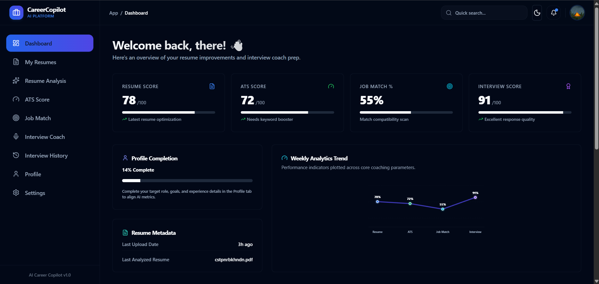
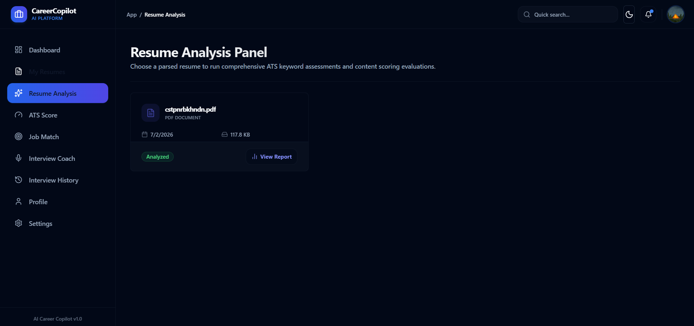
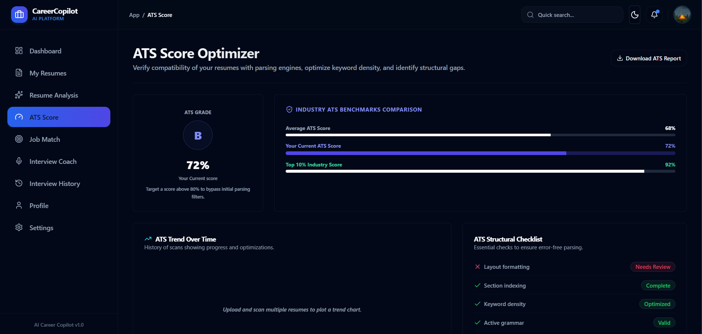
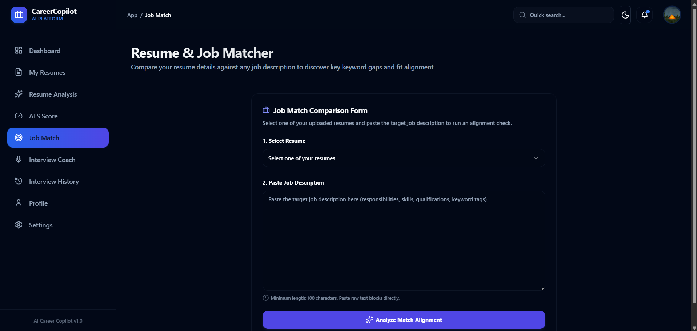
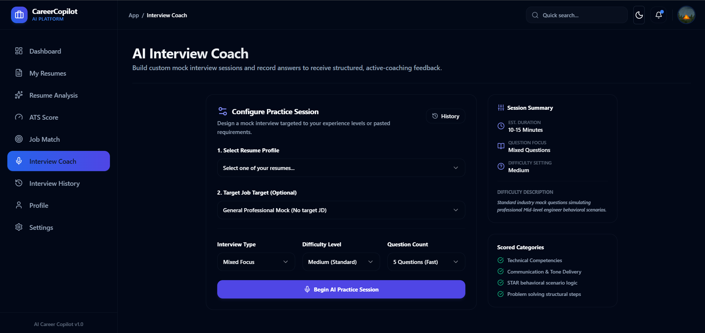
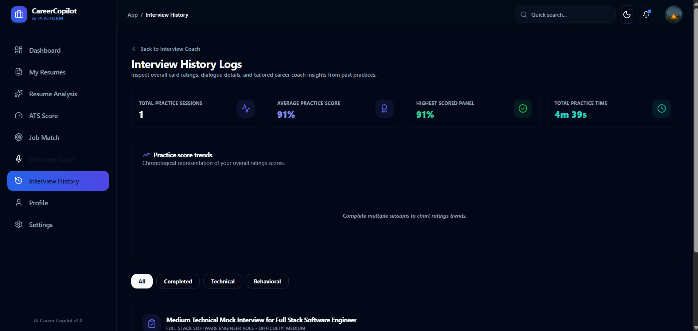
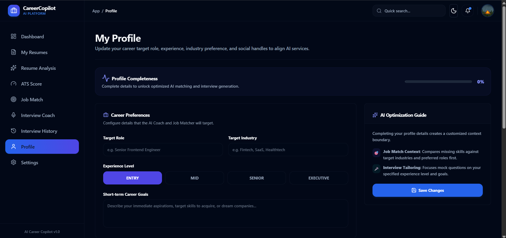
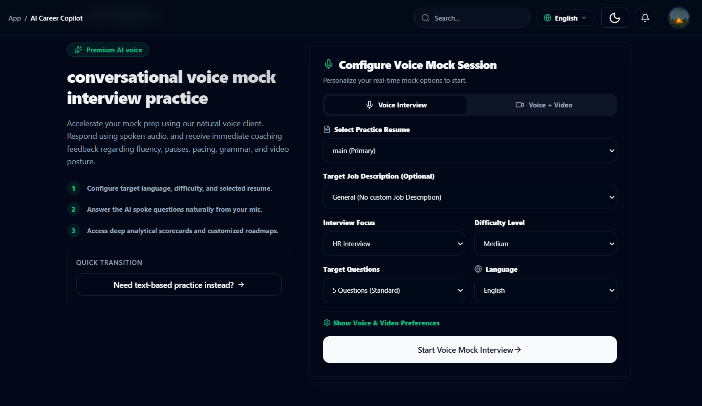
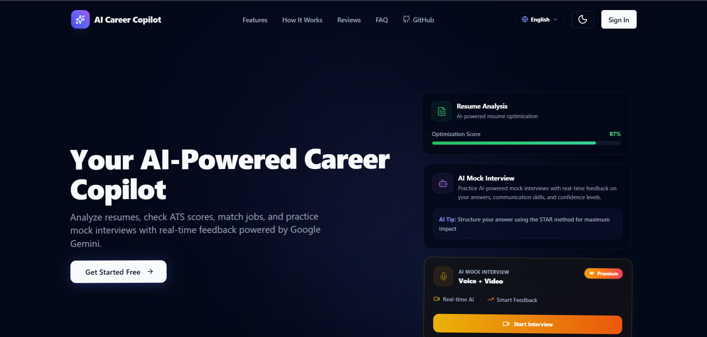

# 🚀 AI Career Copilot

[](LICENSE)
[](https://nextjs.org/)
[](https://react.dev/)
[](https://www.prisma.io/)
[](https://neon.tech/)
[](https://clerk.com/)
[](https://uploadthing.com/)
[](https://deepmind.google/technologies/gemini/)
[](https://vercel.com/)
[](https://github.com/piyush-garg-web/ai-career-copilot)

> **Your intelligent career companion — optimize resumes, align with job descriptions, and prepare for interviews with AI-powered guidance.**

**AI Career Copilot** is a full-stack, AI-powered career assistant built for modern job seekers. It helps candidates optimize resumes for ATS compatibility, analyze alignment with job descriptions, and prepare through interactive mock interviews with AI-powered evaluation and personalized feedback — all within a polished, responsive SaaS dashboard.

Built with **Next.js 15**, **React**, **Prisma**, **PostgreSQL**, **Clerk**, **UploadThing**, and **Google Gemini AI**.

<p align="center">
<a href="https://ai-career-copilot-gray.vercel.app/">Live Demo</a> •
<a href="https://github.com/piyush-garg-web">GitHub</a> •
<a href="https://www.linkedin.com/in/piyushgarg-dev">LinkedIn</a>
</p>

---

## 💡 Why AI Career Copilot?

Today's job seekers need more than just applying for roles online. They need **optimized resumes** that pass ATS filters, a **clear understanding of job descriptions**, and **structured interview preparation** to stand out in competitive hiring pipelines.

**AI Career Copilot** addresses this by combining:

- **Resume optimization** — ATS compatibility analysis, quality evaluation, and actionable improvements
- **Job description analysis** — Compare resumes against role requirements
- **Skill gap identification** — Surface missing keywords and competencies
- **AI-powered interview practice** — Role-specific mock sessions with scored feedback
- **Personalized career feedback** — Tailored suggestions based on profile and goals

---

## 🌐 Live Demo

Experience the application live:

**[https://ai-career-copilot-gray.vercel.app/](https://ai-career-copilot-gray.vercel.app/)**

---

## 📸 Screenshots

| Dashboard View | AI Resume Analysis |
| :---: | :---: |
|  |  |

| ATS Score & Metrics | Job Alignment Match |
| :---: | :---: |
|  |  |

| Interactive Interview Coach | Interview History |
| :---: | :---: |
|  |  |

| Profile Preferences | Voice-Video Interview |
| :---: | :---: |
|  |  |

| Landing Page |
| :---: | :---: |
|  |

---

## ⚡ Project Highlights

- Built with **Next.js 15 App Router** for modern server-side rendering and routing
- **AI integration** using Google Gemini for resume analysis, job matching, and interview coaching
- **Resume processing pipeline** supporting PDF and DOCX document extraction
- **Clerk authentication** with OAuth and protected route middleware
- **Prisma ORM** with a relational database design for users, resumes, and interviews
- **PostgreSQL on Neon DB** for serverless, scalable data persistence
- **UploadThing** for secure resume file storage and retrieval
- **Serverless architecture** deployed on Vercel with zero infrastructure management
- **Responsive SaaS dashboard** with dark/light mode and polished UI/UX

---

## ✨ Features

### 🔐 Authentication & Onboarding

- Clerk authentication with OAuth login (Google, GitHub)
- Email verification for secure account creation
- Protected routes enforced via Next.js middleware
- Personalized onboarding to capture career goals and preferences

### 📄 Resume Optimization

- Secure resume uploads via UploadThing (PDF/DOCX, up to 10MB)
- Text extraction using `pdf-parse` and `mammoth`
- AI-assisted ATS compatibility analysis
- Resume quality evaluation across structure, formatting, and content
- Grammar and formatting suggestions with actionable improvements

### 🎯 Job Description Alignment

- Side-by-side resume and job description comparison
- Skill gap analysis with missing keyword detection
- Match percentage scoring for role alignment
- AI-generated recommendations to tailor bullet points and keywords

### 💬 AI Mock Interview Coach

- Resume-based and role-specific interview question generation
- Configurable difficulty levels for targeted practice
- AI answer evaluation with detailed scoring and feedback
- Ideal answer suggestions for each question
- Full interview history with session summaries and transcripts

### 📊 Dashboard

- Centralized analytics and activity overview
- Resume records management
- Interview history and performance tracking
- User profile and career preference settings
- Dark/light mode toggle powered by `next-themes`
- Fully responsive UI across desktop and mobile

---

## 🛠️ Tech Stack

### Frontend

| Technology | Purpose |
| :--- | :--- |
| Next.js 15 | App Router, SSR, and API route handlers |
| React 18 | Component-based UI |
| Tailwind CSS | Utility-first styling |
| Framer Motion | Animations and transitions |

### Backend

| Technology | Purpose |
| :--- | :--- |
| Next.js Route Handlers | Serverless API endpoints |
| Serverless APIs | Stateless request processing on Vercel |

### Database

| Technology | Purpose |
| :--- | :--- |
| PostgreSQL (Neon DB) | Serverless relational database |
| Prisma ORM | Schema management and type-safe queries |

### Authentication

| Technology | Purpose |
| :--- | :--- |
| Clerk | Identity provider, OAuth, and session management |

### Storage

| Technology | Purpose |
| :--- | :--- |
| UploadThing | Secure resume file uploads and hosting |

### AI

| Technology | Purpose |
| :--- | :--- |
| Google Gemini API | Resume analysis, job matching, and interview evaluation |

### Deployment

| Technology | Purpose |
| :--- | :--- |
| Vercel | Serverless hosting and CI/CD |

---

## 📐 Architecture Overview

```
User
 |
Next.js Frontend
 |
API Routes
 |
-------------------------------
|              |              |
Prisma     Gemini AI     UploadThing
 |
PostgreSQL
```

### Layer Breakdown

| Layer | Description |
| :--- | :--- |
| **Frontend** | Responsive Next.js App Router UI with client and server components |
| **Backend / Serverless** | Next.js API Route Handlers running as Vercel Serverless Functions |
| **Database** | PostgreSQL on Neon DB, accessed through Prisma Client |
| **AI Processing** | Document text extraction forwarded to Google Gemini with structured prompts |
| **Authentication** | Clerk JWT validation in middleware with user sync via webhooks |

> For detailed schemas, data flows, and component diagrams, see the **[Architecture Guide](docs/ARCHITECTURE.md)**.

---

## 📁 Repository Structure

```
ai-career-copilot/

├── docs/
│   ├── ARCHITECTURE.md
│   ├── SETUP.md
│   ├── FEATURES.md
│   ├── DATABASE.md
│   └── API.md

├── prisma/
├── public/
├── screenshots/

└── src/
    ├── app/
    ├── components/
    └── lib/
```

---

## 🗄️ Database Design

```
User
 |
 |---- Resume
 |
 |---- InterviewSession
 |
 |---- JobMatch
 |
 |---- JobDescription
```

The schema uses **Prisma ORM** with PostgreSQL on Neon DB. Core models include `User`, `Resume`, `ResumeAnalysis`, `JobDescription`, `JobMatch`, `InterviewSession`, `InterviewQuestion`, and `InterviewAnswer` — with cascade deletes and indexed foreign keys for efficient queries.

Database schema documentation: **[Database Documentation](docs/DATABASE.md)**

---

## 🔌 API Overview

| Endpoint | Description |
| :--- | :--- |
| `/api/resumes` | Resume upload, parsing, and AI analysis |
| `/api/interviews` | AI interview session generation and evaluation |
| `/api/job-matches` | Resume-to-job-description matching and skill gap analysis |
| `/api/user` | User profile and preference operations |

> For full endpoint documentation, request/response schemas, and authentication details, see **[API Reference](docs/API.md)**.

---

## ⚙️ Installation

### 1. Clone the Repository

```bash
git clone https://github.com/piyush-garg-web/ai-career-copilot.git
cd ai-career-copilot
```

### 2. Install Dependencies

```bash
npm install
```

### 3. Configure Environment Variables

Create a `.env` file in the project root and add the following variables:

```env
# Database Configuration
DATABASE_URL="your-neon-postgres-connection-string"
DIRECT_URL="your-neon-postgres-direct-connection-string"

# Clerk Authentication Configuration
NEXT_PUBLIC_CLERK_PUBLISHABLE_KEY="your-clerk-publishable-key"
CLERK_SECRET_KEY="your-clerk-secret-key"
NEXT_PUBLIC_CLERK_SIGN_IN_URL="/sign-in"
NEXT_PUBLIC_CLERK_SIGN_UP_URL="/sign-up"
NEXT_PUBLIC_CLERK_AFTER_SIGN_IN_URL="/dashboard"
NEXT_PUBLIC_CLERK_AFTER_SIGN_UP_URL="/dashboard"

# UploadThing Configuration
UPLOADTHING_SECRET="your-uploadthing-secret"
UPLOADTHING_APP_ID="your-uploadthing-app-id"

# AI Provider Configuration
AI_PROVIDER="gemini"  # Options: "gemini", "openai", "grok"

# Google Gemini API Key
GEMINI_API_KEY="your-gemini-api-key"
GEMINI_MODEL="gemini-2.5-flash"

# OpenAI API Key (for fallback)
OPENAI_API_KEY="your-openai-api-key"

# Grok (xAI) API Key (for fallback)
GROK_API_KEY="your-grok-api-key"

# Groq API Key for Whisper Speech-to-Text
GROQ_API_KEY="your-groq-api-key"

# Razorpay Configuration (Test Mode)
RAZORPAY_KEY_ID="your-razorpay-key-id"
RAZORPAY_KEY_SECRET="your-razorpay-key-secret"
NEXT_PUBLIC_RAZORPAY_KEY_ID="your-razorpay-key-id"
```

### 4. Set Up the Database

```bash
npx prisma db push
npx prisma generate
```

### 5. Run the Development Server

```bash
npm run dev
```

Open [http://localhost:3000](http://localhost:3000) in your browser.

> For comprehensive setup instructions, see the **[Setup Guide](docs/SETUP.md)**.

---

## 📦 Deployment

This project is configured for one-click deployment on **Vercel**:

1. **Connect** your GitHub repository to Vercel.
2. **Add environment variables** — paste all keys from your `.env` file into the Vercel project settings.
3. **Deploy** — Vercel auto-detects Next.js and runs `npm run build`.

For Clerk webhook configuration to sync users with the database, refer to the **[Setup Guide](docs/SETUP.md)**.

---

## 🔮 Future Roadmap

- **Voice AI Interviews** — Conversational mock interviews with speech-to-text and audio feedback
- **Advanced Analytics** — Trend graphs for ATS compatibility improvements and interview performance over time
- **Resume Comparison** — Side-by-side multi-resume keyword and structure analysis
- **AI Resume Builder** — Generate tailored resumes from AI recommendations
- **Video Interview Analysis** — Review posture, expressions, and timing from camera-based mockups

---

## 🤝 Contributing

Contributions are welcome! Please follow the standard GitHub workflow:

1. **Fork** the repository.
2. **Create** a feature branch (`git checkout -b feature/your-feature`).
3. **Commit** your changes (`git commit -m 'Add your feature'`).
4. **Push** to the branch (`git push origin feature/your-feature`).
5. **Open** a Pull Request with a clear description of your changes.

---

## 🔒 Security

- **Never commit `.env` files** or any files containing secrets to version control.
- **Store all secrets** in environment variables — locally via `.env` and in production via your hosting provider.
- **Protect API keys** — restrict Gemini, Clerk, and UploadThing keys to authorized environments only.

---

## 👨‍💻 Author

**Piyush Garg**

Full Stack Developer passionate about:

- React
- Next.js
- Node.js
- AI technologies

**GitHub:** [https://github.com/piyush-garg-web](https://github.com/piyush-garg-web)

**LinkedIn:** [https://www.linkedin.com/in/piyushgarg-dev](https://www.linkedin.com/in/piyushgarg-dev)

---

## 📄 License

This project is licensed under the **MIT License**. See [LICENSE](LICENSE) for full details.
